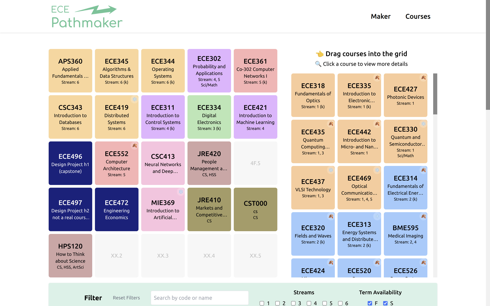

# ECE Pathmaker

ECE Pathmaker is a visual drag-and-drop course planner for UofT electrical and computer engineering students. As an unofficial companion tool to UofT ECE's Magellan, it simplifies the planning process before finalizing your pre-registration.



## Tech Stack

The project is built using the following technologies:
- **Frontend**: React, TypeScript, HTML, Tailwind CSS, dnd-kit (drag-and-drop), shadcn/ui (tooltip buttons)
- **Testing**: Jest, manual testing
- **Build Tools**: Vite, PostCSS
- **Version Control**: Git, GitHub
- **CI/CD**: Hosted with continuous integration and deployment on Vercel

## Feedback

I value your feedback! Please provide your feedback [here](https://forms.gle/YjY4d6zPToQ9c2Ea6).  
NOTE: `**` was used a separation character initially, but replaced it with `%%` to avoid causing bold text when sending on messaging platforms.

## Getting Started

To get started with the project, follow these steps:

1. Clone the repository
2. Install dependencies: `npm install`
3. Start the development server: `npm run dev`

## Contributing

Contributions are welcome! Please fork the repository and submit a pull request.

## Future Work

- [x] Proper mobile experience
- [x] Add more courses and course information in database (all courses in Magellan)
- [x] Use `localStorage` to store data in the browser
- [x] Clear grid button
- [x] Screenshot button
- [x] Easier way to edit colors
- [x] Support for co-requisites
- [x] Dark mode
- [ ] 6th column for overloading (in a different color)
- [ ] Proper backend to store core course details and improve save/load functionality
- [ ] Store data in the URL
- [ ] Google OAuth login (Firebase)
- [ ] Checking for minors and certificates (much hardcoding)
- [ ] Extend to other engineering disciplines

## Example

Try this layout! ECE graduation, AI minor, business certificate (screenshot above):

```plaintext
APS360Applied Fundamentals of Deep Learning%%6#ffd699$$ECE345Algorithms & Data Structures%%6k#ffd699$$ECE344Operating Systems%%6k#ffd699$$ECE302Probability and Applications%%45m#e6b3ff$$ECE361Co-302 Computer Networks I%%5k#ffb3b3@@CSC343Introduction to Databases%%6#ffd699pESC190|ECE345$$ECE419Distributed Systems%%6s#ffd699pECE344|ECE353$$ECE311Introduction to Control Systems%%4k#e6b3ff$$ECE334Digital Electronics%%3k#b3e6b3$$ECE421Introduction to Machine Learning%%4#e6b3ffpSTA286|ECE302@@ECE496Design Project h1 (capstone)%%#091f7d$$ECE552Computer Architecture%%5f#ffb3b3$$CSC413Neural Networks and Deep Learning%%#ffc2e0pCSC311|CSC411|STA314|ECE421|ROB313$$JRE420People Management and Organizational Behaviour%%h#d4a5a5$$@@ECE497Design Project h2 not a real course (capstone)%%#091f7d$$ECE472Engineering Economics%%#091f7d$$MIE369Introduction to Artificial Intelligence%%s#ffc2e0pMIE236|ECE286|ECE302$$JRE410Markets and Competitive Strategy%%c#a89c64$$CST000cs%%c#a89c64@@HPS120How to Think about Science%%ha#d4a5a5$$
```